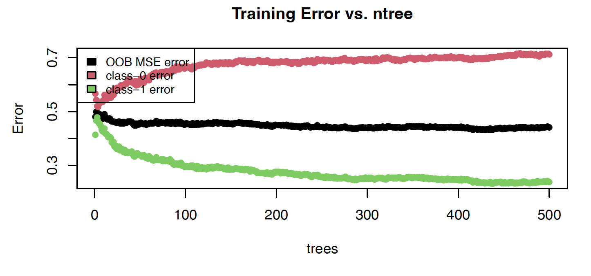
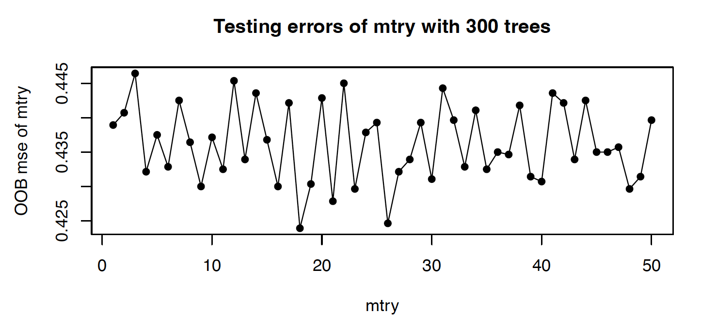
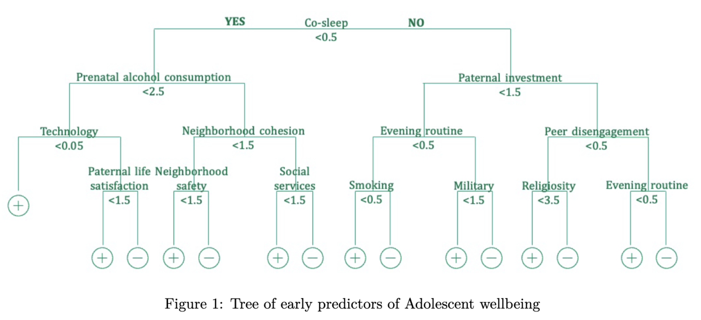

# fragile_family

In late 2021 the US Surgeon General’s Advisory released a public health statement about the alarming assaults on youth wellbeing. Even before the COVID pandemic, 20% of US youth reported a mental health disorder, and only half received appropriate treatment. 

The global burden of childhood mental health symptoms is significant, non-communicable diseases are now the leading cause of disability. This longstanding public health problem has developed a large body of research linking early childhood exposures to longitudinal health outcomes. Specifically, adverse childhood experiences were identified in a landmark study as associated with almost every adult disease. These include neighborhood violence, food insecurity, interpersonal trauma, and other assaults to development. This study, and research that followed, had significant impact for healthcare systems that had not traditionally considered social structures as exposures for health outcomes. 

Where there is a robust body of work about early predictors of adolescent outcomes, there are several gaps in this understanding. This study will fill these gaps using a unique application of a longitudinal dataset through the following aims: 

1) develop a model of adolescent well-being from early social and structural health determinants and 
2) determine which informant report is most predictive in this model.*

We tested a variety of models to understand the relationship between early life factors and adolescent wellbeing. Model 1 includes linear regression, linear regression with LASSO regularization, relaxed LASSO in linear regression. We then used a 0-1 classification in Model 2 to test logistic regression with LASSO and relaxed LASSO in logistic regression. Model 3 tests a random forest model with the addition of PCA transformed data. Model 4 tests a LASSO logistic model with PCA scores. Finally, we used bagging to build an ensemble model and chose Model 3 with a representative tree with 5 nodes for interpretation.

There are two environmental exposures negatively predictive of adolesent wellbeing- household smoking and prenatal alcohol consumption. Community saftey, cohesion (willingness of neighbors to help each other) and avaliability of social services like food stamps are also important contributors of wellbeing. Finally, father's self report of life satisfaction and investment in their child's life are important predictive factors. There are a couple of factors that have a neuanced interpretation. For example, not having a computer in the home is associated with wellbeing. We may expect that family access to technology would facilitate accessing resources that promote healthy development. That said, excessive exposure to screens is well understood to stiffen brain maturation in early life. 

